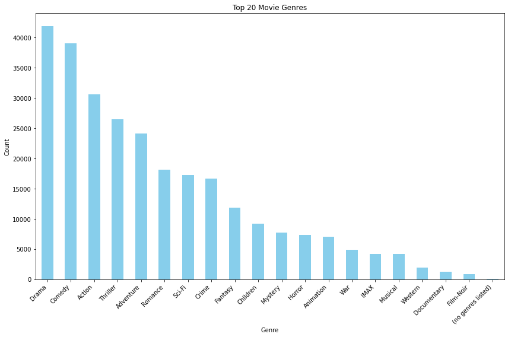
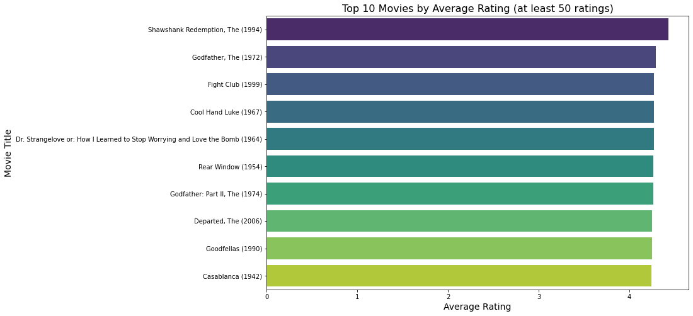
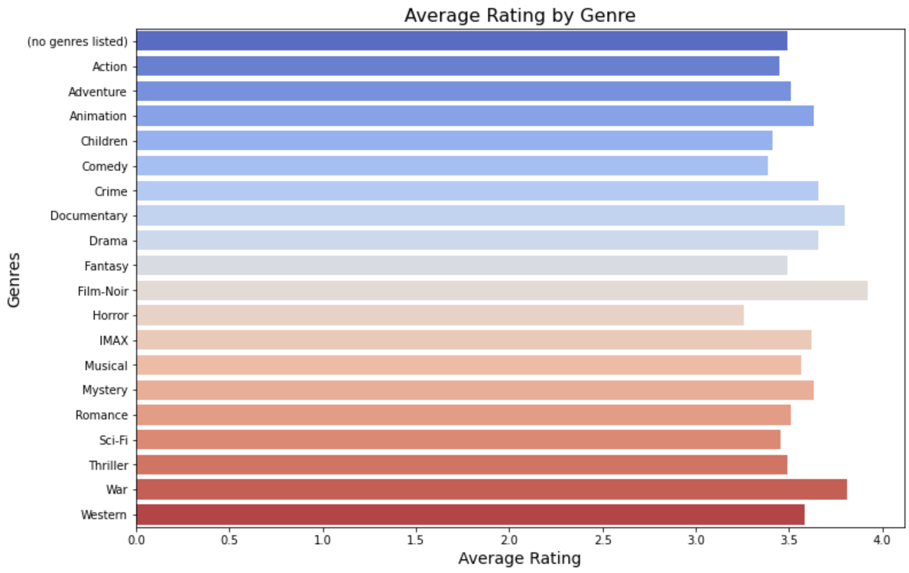

# Movie Reccomendation System
###### Authors ;
[Noel Christopher](https://github.com/NOE0464) 

[Savins Nanyaemuny](https://github.com/Rhino-byte)

[Anthony Ekeno](https://github.com/sananthonio)

[Linet Lydia](https://github.com/LinetLydia)

[Imran Mahfoudh](https://github.com/Bushman57)

## Business Understanding
In today's data-driven world, personalizing user experiences is essential for boosting engagement, satisfaction, and revenue. For a movie streaming platform, a recommendation system can deliver tailored suggestions based on user preferences and behavior. This project focuses on building a robust movie recommender system using **collaborative filtering**, **matrix factorization**, and a **hybrid model** to enhance the quality and precision of recommendations, ultimately improving user satisfaction and platform engagement.

---

## Business Question
**How can we build a recommendation system to provide personalized movie suggestions to users, improving engagement and satisfaction?**

---

## Key Stakeholders
1. **Users**: The primary beneficiaries who receive personalized recommendations. Their engagement and feedback are critical to the system's success.
2. **Business Owners/Executives**: They are focused on user satisfaction, retention, and platform revenue driven by the recommendation system.

---

## Problem Statement
The platform needs a recommendation system to:
- Predict user preferences and generate personalized movie recommendations.
- Enhance customer satisfaction and retention with tailored suggestions.
- Increase user engagement, conversion rates, and revenue.
- Address the "cold start problem" for new users and movies with limited data.
- Balance accuracy, scalability, and real-time processing for seamless recommendations.

---

## Objectives
1. **Collaborative Filtering**: Build a model leveraging user-item interactions (e.g., ratings, viewing history).
2. **Matrix Factorization**: Apply techniques like Singular Value Decomposition (SVD) to uncover latent user-movie relationships.
3. **Hybrid Model**: Combine collaborative filtering and matrix factorization for improved accuracy and coverage.
4. **Cold Start Problem**: Provide effective recommendations for new users and newly added movies with minimal data.
5. **Performance Optimization**: Ensure scalability and real-time processing capabilities.
6. **Model Evaluation**: Use metrics such as precision, recall, accuracy, and NDCG to assess performance.

---

## Success Criteria
1. **Improved Accuracy**: Hybrid models must outperform standalone collaborative filtering and matrix factorization methods.
2. **Cold Start Handling**: Provide meaningful recommendations for new users and movies with minimal performance drop.
3. **Scalability**: Handle a growing user base and movie catalog without compromising responsiveness.
4. **Increased Engagement**: Boost user interactions (e.g., views, ratings, or watch time) with recommended content.
5. **Business Impact**: Drive key metrics like increased subscriptions, user retention, and overall revenue.

--- 

This system aims to redefine personalized movie recommendations, delivering impactful user experiences while supporting the platform's growth and business goals.

# Reasons and Importance of Models

## Collaborative Filtering:
-Reason: Collaborative filtering leverages historical user-item interactions (e.g., ratings, watch history) to make personalized recommendations.

-Importance: It helps identify similar users and suggests movies based on what others with similar tastes have liked, improving user satisfaction and engagement.

### Matrix Factorization:
-Reason: Matrix factorization techniques like Singular Value Decomposition (SVD) decompose the user-movie interaction matrix into latent factors, revealing hidden relationships between users and movies.

-Importance: It enables the system to make better predictions, especially in sparse datasets (where many user-movie interactions are missing), enhancing recommendation accuracy.

**By utilizing these models, the movie recommender system will be more effective, engaging, and scalable, ultimately leading to a better user experience and helping the platform achieve its key business goals**

## Data understanding

### Movie-dataset
-Data Overview: The dataset contains 9,742 rows and 3 columns: movieId (integer), title (string), and genres (string). All columns have non-null values, with movieId being unique for each entry.

-Summary Statistics: The movieId values range from 1 to 193,609, with a mean value of 42,200, and the most frequent genre is "Drama" (appearing 1,053 times). The dataset has minimal missing data, and the most common movie title is "Confessions of a Dangerous Mind (2002)" which appears twice.

-Shape and Uniqueness: The dataset has a shape of (9742, 3), with movieId containing 9742 unique values, title having 9737 unique values (indicating some duplicate titles), and genres having 951 unique genre types.

-No Duplicates: There are no duplicate movieId values in the dataset, but some movie titles are repeated, suggesting potential cases where the same movie appears with slightly different versions or formats.

### Ratings-dataset
 -Data Overview: The ratings dataset contains 100,836 rows and 4 columns: userId (integer), movieId (integer), rating (float), and timestamp (integer). All columns have non-null values, and the data is structured to track movie ratings by users.

-Summary Statistics: The userId ranges from 1 to 610, with a mean value of 326, and the movieId spans from 1 to 193,609, covering a wide range of movies. The average rating is 3.5 (on a 1-5 scale), and the most frequent timestamp corresponds to the period around 1.2 billion seconds since January 1970.

-Shape and Uniqueness: The dataset has a shape of (100836, 4), with userId containing 610 unique values, movieId containing 9,724 unique movie identifiers, and rating having 10 possible unique rating values. The timestamp column has 85,043 unique values, showing a diverse set of rating times.

-No Duplicates: There are no duplicate rows in the dataset, ensuring that each rating is unique for a given userId and movieId combination, although there may be multiple ratings by the same user for different movies.

## Data Cleaning

Missing values and duplicated rows are handled. Also, columns irrelevant to the project are dropped. Formatting of columns and their contents for smooth analysis.

## Data Merging
-ratings and movies, is merged on the movieId column using an inner join.

-An inner join was used to merge the two DataFrames based on movieId, ensuring only movies that have both ratings and metadata (title/genres) are included, excluding entries with missing data in either DataFrame.

-Shape: The resulting DataFrame has 100,836 entries and 6 columns.

-Columns: contains columns: userId, movieId, rating, timestamp, title, and genres.

-Data Types: The columns contain data types: int64 for identifiers, float64 for ratings, and object for movie title and genres.

-Summary Statistics: Basic descriptive statistics show mean ratings of 3.5, with a rating range from 0.5 to 5.

-Value Counts: 100,836 entries, each representing a unique rating event, with a mix of ratings across various movies and genres.

-Unique Entries: The data includes various combinations of userId, movieId, rating, and timestamp for different movies, showing no duplicates or repeated entries.

-Duplicated Entries: no duplicated rows

# DataSAnalysis; visaualisations
a)General Top-rated genres are Action, comedy and drama

b)Top-rated movies that is at least 50 rated is Shawshank redemption, the (1994)

c)Avarage ratings per genres: film-noir and war are recommended

# Data Preparation
-Split data TRAIN & TEST:Splitting the data ensures that the model is trained on one part of the data and evaluated on unseen data to measure its generalization performance.
-Importance:Prevents overfitting. Provides an unbiased evaluation of the model.

`Splitting the data into train and test sets (80-20 split)
Training data size: 80668
Testing data size: 20168`

# Feature Engineering
Enhance the dataset by extracting meaningful features, such as genres, and normalizing ratings to improve matrix factorization performance.

Content-based filtering relies on genres. Normalization reduces biases caused by individual user rating scales

### User-Based Collaborative Filtering (UBCF)
**Performance Metrics:**
`RMSE: 0.8808
MAE: 0.6753
Precision at 10: 0.6551
Recall at 10: 0.6787
Accuracy: 0.6584`

**Advantages:**
`Simple to implement and interpret.
Effective when there is a large amount of user data available.
Can provide personalized recommendations based on similar users.`

**Disadvantages:**
`Suffers from the "cold start" problem for new users.
Performance can degrade with sparse data.`

### Item-Based Collaborative Filtering (IBCF)
**Performance Metrics:**
`RMSE: 0.8911
MAE: 0.6866
Precision at 10: 0.6650
Recall at 10: 0.6767
Accuracy: 0.6345`

**Advantages:**
`More stable than UBCF as it relies on item similarities rather than user similarities.
Can be effective in systems with high user turnover.`

**Disadvantages:**
`Requires a good amount of item data to be effective.
May not capture user preferences as effectively as UBCF`

### Model-Based Collaborative Filtering (Matrix Factorization using SVD)
**Performance Metrics:**
`RMSE: 0.8712
MAE: 0.6693
Precision at 10: 0.6682
Recall at 10: 0.6758
Accuracy: 0.6405`

**Advantages:**
`Handles sparsity well and scales efficiently for large datasets.
Can uncover latent features that represent user preferences and item characteristics.
Generally provides better accuracy than memory-based methods.`

**Disadvantages:**
`More complex to implement and requires more computational resources.
May require tuning of hyperparameters for optimal performance`

